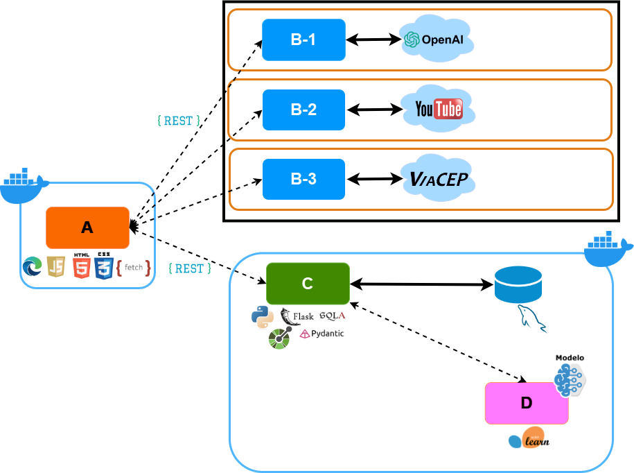
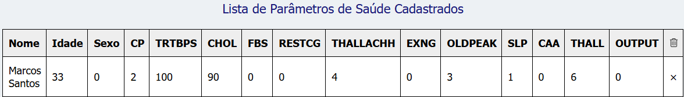

# *Brazilian Jiu-Jitsu Training Log - Frontend*

Esta é uma aplicação web que permite o acompanhamento objetivo do progresso do aprendizado de técnicas de Jiu-Jitsu, um pequeno projeto que constitui o MVP a ser apresentado à disciplina **Qualidade de Software, Segurança e Sistemas Inteligentes** do curso de **Pós-graduação em Engenharia de Software - PUC-Rio**

## Descrição


Artes Marciais são sistemas de luta que codificam e organizam movimentos visando ao combate corpo-a-corpo, presentes em diversas culturas e tradições milenares.
No mundo moderno, a prática de artes marciais ganhou contornos diferentes das motivações simplesmente militares que as originaram, tornando-se um negócio bilionário. Em grande medida, essa popularização se deve aos benefícios para a saúde física, mental e  possíveis benefícios para autodefesa.
Não obstante as diferenças de origens, princípios e técnicas entre esses sistemas, de alguma forma todos eles avaliam seus praticantes periodicamente, a fim de posicioná-los conforme nível técnico. Os critérios dessas avaliações podem incluir tempo de prática, frequência, resultados em torneios e desempenho nas sessões de treino, além de outros aspectos.
Em particular, a análise de desempenho e domínio técnico pode ser subjetiva, a partir da perspectiva de algum instrutor. O aluno pode sentir-se trilhando uma jornada obscura, com dificuldades para reconhecer os próprios avanços, o que pode ser bastante desmotivante.
Nesse contexto, seria muito interessante que houvesse um sistema objetivo, quantitativo, para acompanhamento do desempenho de praticantes durante sessões de treino, que pudesse ser conduzido pelo próprio praticante ou pelo professor de uma escola.
A presente ferramenta se propõe a preencher essa lacuna, possibilitando não somente o registro gradual das técnicas aprendidas por um praticante, mas também as respectivas tentativas de aplicações, como métrica de progresso na maestria das técnicas. Essas tentativas podem culminar em sucesso ou insucesso, seja no papel de ataque ou defesa do praticante em questão.
Apesar do Jiu-Jitsu Brasileiro (*Brazilian Jiu Jitsu*) ter sido aqui eleito como caso de uso, considerando sua popularidade e a tradição de prática de lutas em todas as sessões de treino, em princípio, esse sistema poderia ser aplicado a qualquer modalidade que permita contar os números de sucessos e insucessos em aplicações de técnicas. A contagem poderia ser efetuada pelo próprio praticante, com base em suas recordações do treinamento, pelo professor assistindo a um pequeno grupo de alunos ou por um sistema de Visão Computacional baseado em vídeo com Estimação de Pose.

---
Veja o [vídeo de apresentação](https://youtu.be/JNw1kgE5TsQ) no Youtube.

---



<center> Figura: Arquitetura do BJJ Training Log </center>

---
## Baixar repositório

Faça uma cópia desse repositório para sua máquina local, preferencialmente com o comando abaixo.
```
git clone git@github.com:jorgejgleandro/bjj-log-app-qsi-front.git
```

Acesse a **branch** *main* do repositório:

```
git checkout main
```

---
## Instalação e Execução

Vale salientar que, para executar a aplicação com esse componente  *frontend*, é necessário que o respectivo componente [*backend*](https://github.com/jorgejgleandro/bjj-log-app-qsi-api) esteja em execução.

---
### Modo desenvolvimento: Execução
Feito isso, abra o arquivo *index.html* no seu browser.

---
### Modo produção via Docker: Instalação
Certifique-se de ter o [Docker](https://docs.docker.com/engine/install/) devidamente instalado e em execução em sua máquina.

Pelo terminal, acesse o diretório que contém o Dockerfile, um nível acima do diretório src/, onde encontram-se os arquivos do frontend

Construa a imagem Docker mediante o seguinte comando, **como administrador**:

```
$ docker build -t nome_da_sua_imagem .
```

### Modo produção via Docker: Execução

Execute o container, execute o seguinte comando, **como administrador**, seguinte o comando:

```
$ docker run -d -p 9000:80 nome_da_sua_imagem
```

Uma vez executando, para acessar o front-end, basta abrir o [http://localhost:9000/#/](http://localhost:9000/#/) no navegador.

Para obter a implementação da **API**, dirija-se ao repositório do componente [*backend*](https://github.com/jorgejgleandro/bjj-log-app-qsi-api) e siga aquelas instruções.

## Principais Funcionalidades

### Doença Cardíaca - Predição com modelo de Aprendizagem de Máquina

Esta aplicação é equipada com um modelo treinado de Aprendizagem de Máquina para predição de alto risco de ataque cardíaco em um praticante, durante uma sessão de treinamento.

Para tanto, o usuário deve fornecer resultados de exames com os 13 parâmetros solicitados na interface. No ato de submissão dos parâmetros de saúde cardíaca de um aluno, o *frontend* realiza uma requisição ao *backend*, em que está embarcado o objeto que representa o modelo treinado de Aprendizagem de Máquina. Então o *backend* persiste o valor da predição no campo correspondente no banco de dados e devolve este valor como resposta à requisição, que é imediatamente exibido na listagem atualizada com esse registro.

---



<center> Figura: Lista de Parâmetros de Saúde com Predição de Risco de Ataque Cardíaco por modelo de Aprendizagem de Máquina (1:alto risco, 0: baixo risco)</center>

---


### APIs Externas Públicas

Três APIs externas foram utilizadas como componentes nesta aplicação, a saber:

1. [OpenAI API](https://openai.com/api/)

Para geração automática de descrição de técnica ao adicioná-la, dado um termo para o nome da técnica, foi usado o modelo [GPT-4o](https://platform.openai.com/docs/models/gpt-4o) da [OpenAI API](https://openai.com/api/), o mais avançado modelo multimodal para geração de texto dessa API, com janela de contexto de *128.000* tokens, e último *checkpoint* de treinamento datado de *Outubro de 2023*.

    1.1. Termos de Uso

    O documento legal que dispõe sobre os termos de uso pode ser encontrado em:

[Terns of Use](https://openai.com/policies/terms-of-use/)

    1.2. Cadastro

    Para execução dessa aplicação, não é necessário cadastro na OpenAI, desde que o usuário esteja em posse de alguma chave **OpenAI_API_KEY**, gerada e fornecida por um assinante dos serviços dessa API.

    Se a chave de API for fornecida, copie seu valor para a variável correspondente no cabeçalho do código do arquivo scripts.js:
```
const OpenAI_API_KEY='PROVIDED_OPENAI_API_KEY'
```

    Caso a chave de API não seja fornecida, siga os passos:

        * Crie uma conta na OpenAI: Acesse o site oficial da OpenAI e faça login com sua conta existente ou crie uma nova conta, se necessário.
        * Acesse suas chaves de API:
            * Após fazer login, clique na foto do seu perfil no canto superior direito.
            * Selecione “Exibir chaves de API”.
        * Crie uma nova chave secreta:
            * Clique no botão “Criar nova chave secreta”.
            * Copie e cole a chave de API como valor para a respectiva variável no arquivo scripts.js: const OpenAI_API_KEY=''

    ou consulte a documentação abaixo

[Developer Quickstart](https://platform.openai.com/docs/quickstart)

    1.3. Rota utilizada

        https://api.openai.com/v1/chat/completions

2. [Youtube Data API](https://developers.google.com/youtube/v3?hl=pt-br)

Para obter o link para um vídeo relacionado ao termo para o nome da técnica, ao adicioná-la, foi usada a [Youtube Data API](https://developers.google.com/youtube/v3/docs/search/list?hl=pt-br)

    2.1. Termos de Serviço

    O documento legal que dispõe sobre os termos de serviços pode ser encontrado em:

> [Youtube API Services Terms of Service](https://developers.google.com/youtube/terms/api-services-terms-of-service)

    2.2. Cadastro

        Para execução dessa aplicação, não é necessário cadastro na Youtube API, desde que o usuário possua alguma chave **Youtube_API_KEY**, gerada e fornecida por um assinante dos serviços dessa API.

            Se a chave de API for fornecida, copie seu valor para a variável correspondente no cabeçalho do código do arquivo scripts.js:
```
const Youtube_API_KEY='PROVIDED_Youtube_API_KEY'
```

        Caso a chave de API não seja fornecida, siga os passos:

            * Crie um projeto no Console de APIs do Google:
                * Acesse o Console de APIs do Google.
                * Crie um novo projeto ou selecione um existente.

            * Ative a API do YouTube para o projeto:
                * No painel do projeto, clique em “Ativar APIs e serviços”.
                * Pesquise por “YouTube Data API” e ative-a.

            * Crie as credenciais necessárias:
                * Acesse a seção “Credenciais” no painel do projeto.
                * Clique em “Criar credenciais” e escolha “Chave de API”.
                * crie uma chave de API
                * Copie e cole a chave de API como valor para a respectiva variável no arquivo scripts.js: const Youtube_API_KEY=''

        ou consulte a documentação abaixo

[Visão Geral da API Youtube Data](https://developers.google.com/youtube/v3/getting-started?hl=pt-br)

    2.3. Rota utilizada

        https://www.googleapis.com/youtube/v3

3. viaCEP API

    3.1. Licença

        Não se aplica

    3.2. Cadastro

        Não se aplica

    3.3. Rota utilizada

        https://viacep.com.br/ws/${cep}/json/


## *Prompt* empregado:

> `Descreva a posição do Brazilian Jiu-Jitsu denominada ${termDescribe}. A descrição deve ser subdividida em: Princípio:, Posição Inicial: (e.g Guarda, Raspagem, Montada), Execução: (passos numerados), Variações:, Dicas Importantes: e Lembre-se:`

, onde **termDescribe** é um *placeholder* para o termo com o nome da técnica fornecido pelo usuário.